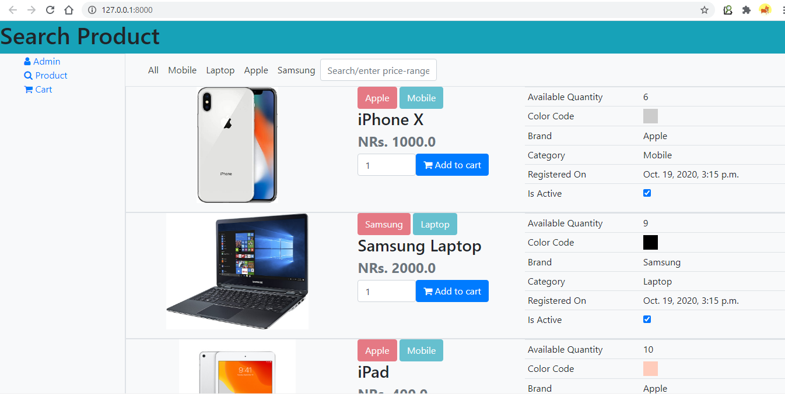
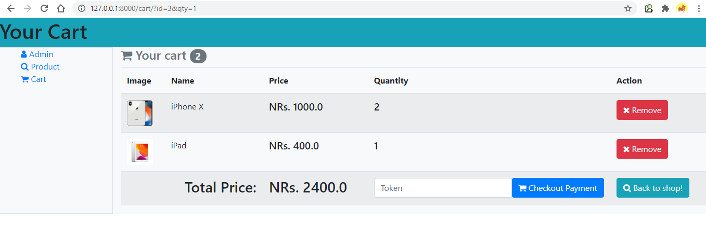
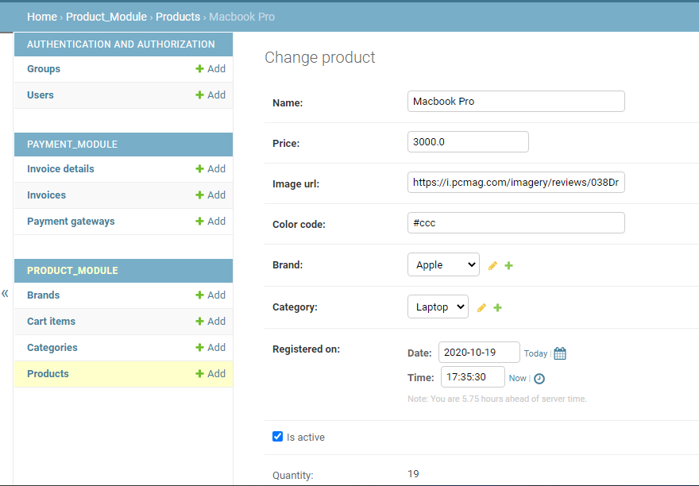

# Introduction: ecommerce-django

- A project to demonstrate an end-to-end working of e-commerce project
- Utilizes django framework for rapid application development (RAD)

# Setup
## Setup virtualenv & install requirements
```
virtualenv venv -p python3
source venv/bin/activate
pip install -r requirements.txt
```

## Prepare for first run
```
python manage.py migrate
python manage.py createsuperuser
```

## Run
```
python manage.py runserver 8888
```

## Visit site
- http://localhost:8888
- http://localhost:8888/admin

## Screenshots
- Search product


- Cart/payment


- Admin


# Thank you!